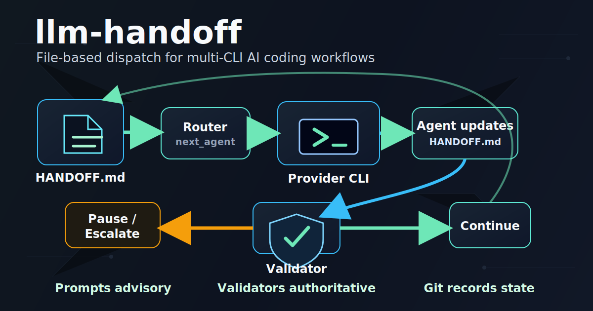

# llm-handoff

[](LICENSE)

`llm-handoff` is a reference implementation of a file-based dispatch loop for
multi-CLI AI coding workflows.

The design principle is simple:

> Prompts are advisory. Validators are authoritative.

Agents can write prose, but the dispatcher only advances when the handoff state
parses, routes, and validates. A single Markdown file is the shared state file.
Git commit SHAs are the durable record of completed work. When routing is
ambiguous or unsafe, the dispatcher fails closed and pauses instead of guessing.

Built for solo developers coordinating multiple agent CLIs on a single repo
without the overhead of git worktrees, pull-request choreography, or a service
orchestrator.



## Status

This repository is in pre-release extraction. The dispatcher is being
genericized from a project-specific implementation into a public reference
workflow. Expect names, configuration, and examples to change until the first
tagged release.

The current scaffold is not a release-ready source checkout yet. See
[CHANGELOG.md](CHANGELOG.md) for the extraction state.

## Repository Map

All Markdown documentation and shipped Markdown prompt artifacts are linked
here. Test fixture handoffs are included in a collapsed section because they
are parser fixtures, not user-facing docs.

### Core Docs

| File | Purpose |
| --- | --- |
| [README.md](README.md) | Public front door and project positioning. |
| [INSTALL.md](INSTALL.md) | Install paths, provider CLI checks, and first run. |
| [CONFIGURATION.md](CONFIGURATION.md) | Supported `dispatch_config.yaml` surface. |
| [docs/ARCHITECTURE.md](docs/ARCHITECTURE.md) | Module map and design choices. |
| [docs/TESTING.md](docs/TESTING.md) | Test strategy and current scaffold state. |
| [AGENTS.md](AGENTS.md) | Instructions for coding agents working in this repo. |
| [CONTRIBUTING.md](CONTRIBUTING.md) | Contribution scope and project boundaries. |
| [SECURITY.md](SECURITY.md) | Safe usage and vulnerability reporting. |
| [CHANGELOG.md](CHANGELOG.md) | Release and extraction history. |

### Runtime And Examples

| File | Purpose |
| --- | --- |
| [dispatch_config.example.yaml](dispatch_config.example.yaml) | Example role-to-provider config shape. |
| [requirements-dev.txt](requirements-dev.txt) | Source-checkout runtime and test dependencies. |
| [examples/reference-workflow/README.md](examples/reference-workflow/README.md) | Copyable workflow protocol plan. |

### Handoff Protocol

| File | Purpose |
| --- | --- |
| [docs/handoff/README.md](docs/handoff/README.md) | Handoff directory guide and schema summary. |
| [docs/handoff/HANDOFF.md](docs/handoff/HANDOFF.md) | Placeholder live handoff template. |
| [docs/handoff/SHARED_REPO_INIT_PROMPT.md](docs/handoff/SHARED_REPO_INIT_PROMPT.md) | Shared startup prompt for roles. |
| [docs/handoff/PLANNER_INITIAL_PROMPT.md](docs/handoff/PLANNER_INITIAL_PROMPT.md) | First planner prompt for new workflows. |
| [docs/handoff/PLANNER_HANDOFF_PROMPT.md](docs/handoff/PLANNER_HANDOFF_PROMPT.md) | Planner handoff prompt. |
| [docs/handoff/BACKEND_HANDOFF_PROMPT.md](docs/handoff/BACKEND_HANDOFF_PROMPT.md) | Backend role prompt. |
| [docs/handoff/FRONTEND_HANDOFF_PROMPT.md](docs/handoff/FRONTEND_HANDOFF_PROMPT.md) | Frontend role prompt. |
| [docs/handoff/AUDITOR_HANDOFF_PROMPT.md](docs/handoff/AUDITOR_HANDOFF_PROMPT.md) | Auditor role prompt. |
| [docs/handoff/FINALIZER_HANDOFF_PROMPT.md](docs/handoff/FINALIZER_HANDOFF_PROMPT.md) | Finalizer role prompt. |

### Provider Agent Templates

| File | Purpose |
| --- | --- |
| [.codex/skills/llm-handoff/SKILL.md](.codex/skills/llm-handoff/SKILL.md) | Codex backend skill bootstrap. |
| [.gemini/agents/planner.md](.gemini/agents/planner.md) | Gemini planner agent template. |
| [.gemini/agents/frontend.md](.gemini/agents/frontend.md) | Gemini frontend agent template. |
| [.claude/agents/auditor.md](.claude/agents/auditor.md) | Claude auditor agent template. |
| [.claude/agents/handoff-router.md](.claude/agents/handoff-router.md) | Claude routing clarification agent. |
| [.claude/agents/handoff-validator.md](.claude/agents/handoff-validator.md) | Claude handoff validator agent. |
| [.claude/agents/ledger-updater.md](.claude/agents/ledger-updater.md) | Claude finalizer compatibility agent. |

<details>
<summary>Ported Test Fixture Markdown</summary>

| File | Purpose |
| --- | --- |
| [tests/ported/fixtures/handoffs/audit_story_close_next_story.md](tests/ported/fixtures/handoffs/audit_story_close_next_story.md) | Router fixture. |
| [tests/ported/fixtures/handoffs/codex_handback_story_close.md](tests/ported/fixtures/handoffs/codex_handback_story_close.md) | Router fixture. |
| [tests/ported/fixtures/handoffs/conflicting_signals.md](tests/ported/fixtures/handoffs/conflicting_signals.md) | Router fixture. |
| [tests/ported/fixtures/handoffs/empty.md](tests/ported/fixtures/handoffs/empty.md) | Router fixture. |
| [tests/ported/fixtures/handoffs/escalation.md](tests/ported/fixtures/handoffs/escalation.md) | Router fixture. |
| [tests/ported/fixtures/handoffs/legacy_manual_frontend_dispatch.md](tests/ported/fixtures/handoffs/legacy_manual_frontend_dispatch.md) | Router fixture. |
| [tests/ported/fixtures/handoffs/misroute.md](tests/ported/fixtures/handoffs/misroute.md) | Router fixture. |
| [tests/ported/fixtures/handoffs/next_step_header_epic_close.md](tests/ported/fixtures/handoffs/next_step_header_epic_close.md) | Router fixture. |
| [tests/ported/fixtures/handoffs/next_step_header_for_codex.md](tests/ported/fixtures/handoffs/next_step_header_for_codex.md) | Router fixture. |
| [tests/ported/fixtures/handoffs/next_step_qualifier_suffix_claude.md](tests/ported/fixtures/handoffs/next_step_qualifier_suffix_claude.md) | Router fixture. |
| [tests/ported/fixtures/handoffs/next_step_subheading_frontend.md](tests/ported/fixtures/handoffs/next_step_subheading_frontend.md) | Router fixture. |
| [tests/ported/fixtures/handoffs/no_signal.md](tests/ported/fixtures/handoffs/no_signal.md) | Router fixture. |
| [tests/ported/fixtures/handoffs/pe_task_assignment_codex.md](tests/ported/fixtures/handoffs/pe_task_assignment_codex.md) | Router fixture. |
| [tests/ported/fixtures/handoffs/prose_next_agent_gemini_pe.md](tests/ported/fixtures/handoffs/prose_next_agent_gemini_pe.md) | Router fixture. |
| [tests/ported/fixtures/handoffs/story_close_ledger_language.md](tests/ported/fixtures/handoffs/story_close_ledger_language.md) | Router fixture. |

</details>

## Source Checkout

This will not be published to PyPI. The intended workflow is clone-and-run from
source:

```bash
git clone https://github.com/choughton/llm-handoff.git
cd llm-handoff
python -m venv .venv
python -m pip install -r requirements-dev.txt
python -m llm_handoff --help
```

See [INSTALL.md](INSTALL.md) for provider CLI checks, local dependencies, and
the planned target-repo initialization workflow.

## What This Is

- A Python CLI for serially dispatching work between AI coding CLIs.
- A file-based operating protocol centered on `HANDOFF.md`.
- A deterministic router with validator-backed failure handling.
- A reference workflow that users can inspect, copy, fork, or adapt.

## What This Is Not

- Not a general multi-agent framework.
- Not parallel execution across branches or worktrees.
- Not a hosted service.
- Not a replacement for Codex, Gemini, Claude, or any other agent CLI.
- Not self-healing. It detects, validates, and pauses.
- Not production-certified for arbitrary repositories.

## How It Works

`llm-handoff` treats model output as untrusted input.

1. The dispatcher reads a handoff file.
2. YAML frontmatter declares the next role.
3. A deterministic router checks the role.
4. If the role is non-canonical, a constrained model-backed normalizer may
   rewrite obvious values or return `unknown`.
5. The configured provider CLI runs one role.
6. The updated handoff is validated.
7. The loop continues, pauses, or escalates to the user.

```text
agent writes HANDOFF.md
        |
        v
dispatcher reads state
        |
        v
router selects next_agent
        |
        v
normalizer resolves non-canonical values
        |
        v
provider CLI runs one role
        |
        v
agent updates HANDOFF.md
        |
        v
validator accepts, pauses, or escalates
```

The handoff file is the mutex and the debugger. There is no hidden queue,
database, or dashboard required to understand the current state.

## Why Not LangGraph, AutoGen, Or CrewAI?

Those projects are broader orchestration frameworks. `llm-handoff` is narrower:
one repo, one branch, one handoff file, one agent at a time. The differentiator
is not a graph runtime. It is the inversion that prompts are advisory while
validators are authoritative. The router can propose, but the loop only
advances when the handoff state parses, routes, and validates.

## Known Limitations

- The reference implementation has been validated primarily in one workflow.
- Provider CLI behavior can change underneath the dispatcher.
- Validator calls optimize for correctness over token cost.
- Dual-run protection and semantic SHA checks are required before public launch.
- Full role-to-provider adapter wiring and `init` template generation are
  still planned work.

See [docs/ARCHITECTURE.md](docs/ARCHITECTURE.md) for the design constraints in
more detail.

## License

Apache License 2.0. See [LICENSE](LICENSE).
